<p align="center">
    
</p>

# __ReplyBot - Telegram Bot for Automated Replies (GUI and System Tray Support)__
ReplyBot is a user-friendly Telegram bot with a Graphical User Interface (GUI) that allows you to automate responses based on predefined rules. Additionally, it provides compiled executables for Linux, Mac, and Windows, and the bot can be minimized to the system tray and run in the background without displaying the GUI.

## __Features__:
+ __Automated Replies__: ReplyBot can instantly respond to incoming messages without the need for manual intervention, saving you time and effort.

+ __Keyword-Based Replies__: You can define specific keywords or phrases to trigger automated responses, ensuring that your bot responds appropriately to relevant messages.

+ __Regular Expression (Regex) Support__: Utilize the power of regular expressions to create more flexible and dynamic response rules, enabling complex matching patterns.

+ __Case-Sensitive Matching__: Choose whether the bot should consider the case when matching keywords or patterns.

+ __Case-Insensitive Matching__: Optionally, you can enable case-insensitive matching to make the bot respond to messages regardless of letter case.

+ __GUI Interface__: Interact with the bot using a friendly and intuitive Graphical User Interface.

+ __System Tray Support__: ReplyBot can be minimized to the system tray, running silently in the background without cluttering your taskbar.

+ __Cross-Platform Compatibility__: Executables are available for Linux, Mac, and Windows operating systems.

## __Prerequisites__
- Python 3.7 or higher
- It's made on Python 3.9.2
- __telegram__ account is also required to get bot token


## __Getting Started__
To use **ReplyBot**, follow these steps:

**Using Executables**:
1. __Download Executables__: 
    + Go to the [Release Page](https://github.com/AKRASH-Nadeem/ReplyBot/releases) and download the appropriate executable for your operating system (Linux, Mac, or Windows).
    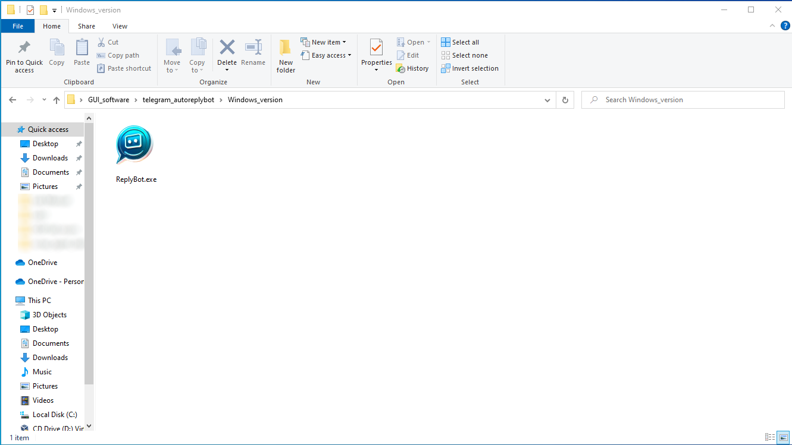
2. __Create a Telegram Bot__:
    + Talk to the BotFather on Telegram to create a new bot and obtain the API token.

    <p align="center">
        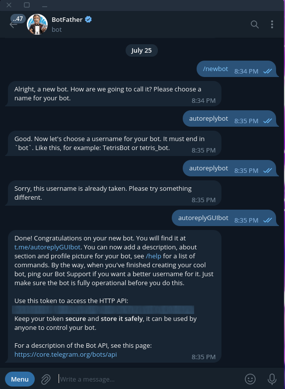
    </p>

3. __Configure the Bot__:
    + Launch the ReplyBot executable.
    + Enter your Telegram Bot API token in the provided field And Click on Test Button.
    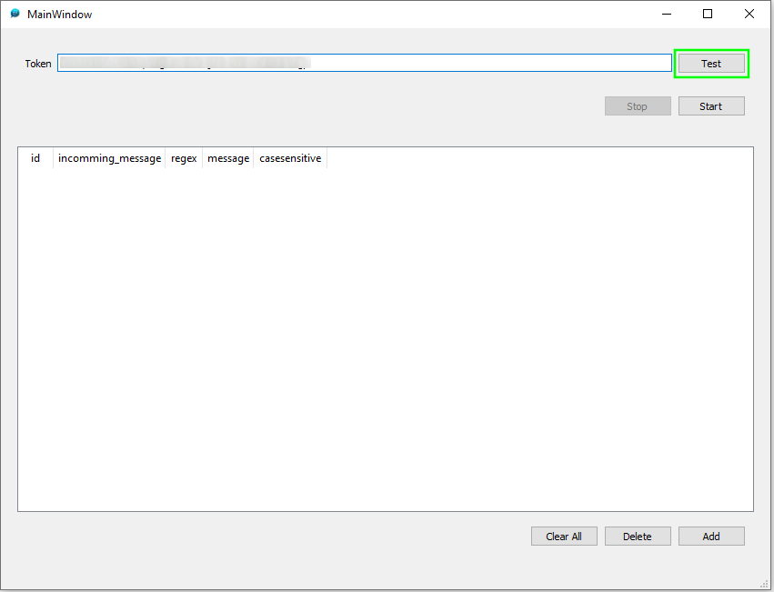

    + Check the __Token is valid__ and ready to be used.Click on __Save__ button if token is __valid__ and __Active__.
    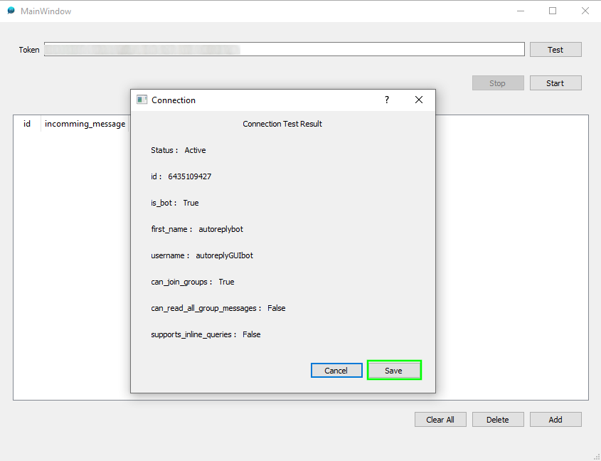

4. __Add Reply__:

    + Click on __Add__ button to add reply messages And __Save__ it.
    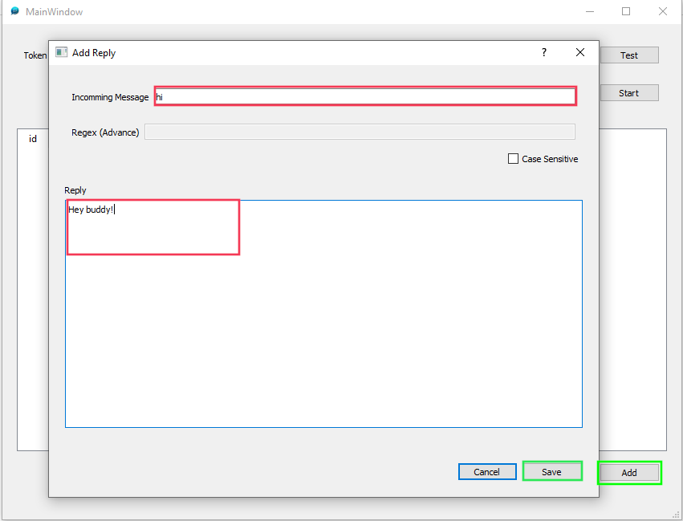
5. __Start Bot__:
    + Start the bot By clicking the Start button.
    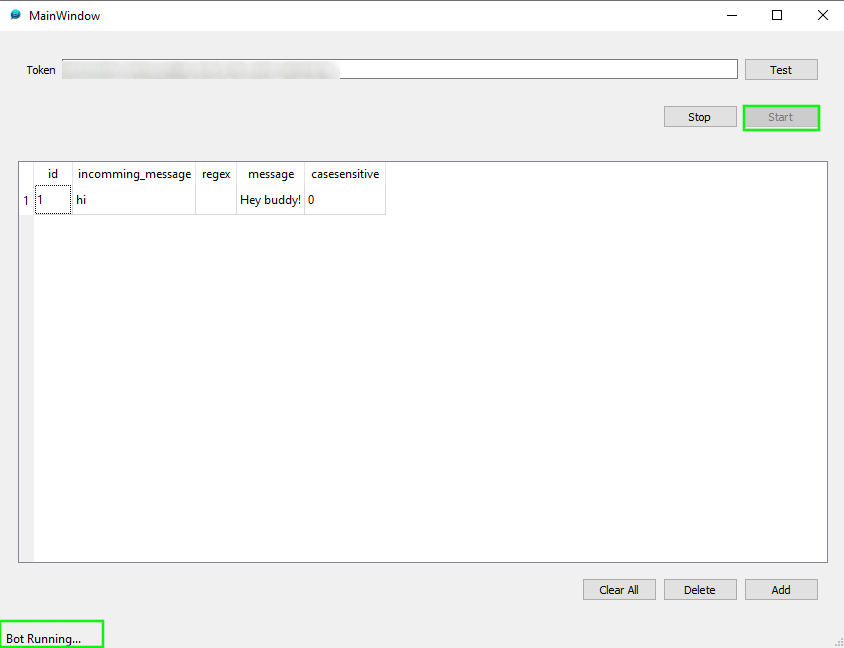
6. __Check the bot working__:
    + Message your bot and see if it works.You can open issue if there is any.
    <p align="center">
        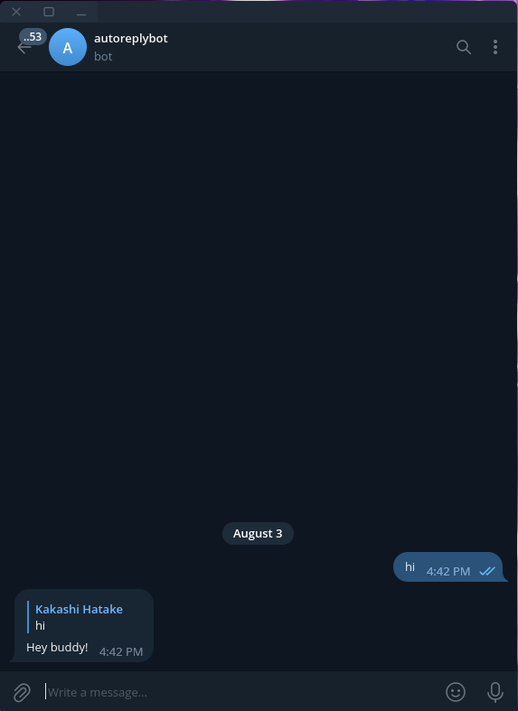
    </p>

## __Stop Bot__
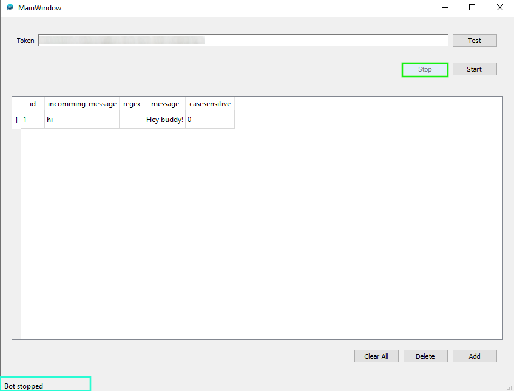

## __Delete the reply__:
+ Select a row and click on delete button
<p align="center">
    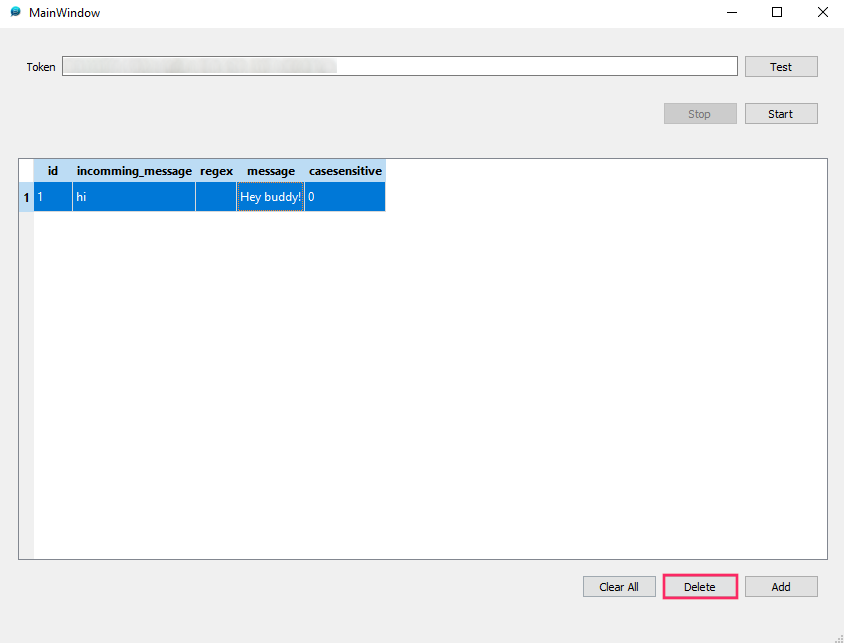
</p>

## __System Tray Support__
ReplyBot can be minimized to the system tray by Closing it, running silently in the background without cluttering your taskbar.
<br>
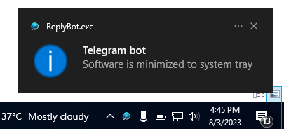

You can see the __icon__ of the bot in __System Tray__ of windows 

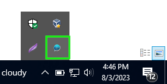

## __Quit__
To Quit the Bot you need to __quit__ it from the __system tray__ menu
<div>
    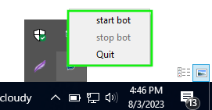
</div>

## __Get Source Code__

```
git clone https://github.com/your-username/replybot.git
cd replybot
```
## Install requirements
```
pip install -r requirements.txt
```
## Run the Bot
```
python main.py
```

# __Contributing__
Contributions to ReplyBot are welcome! If you have suggestions, bug fixes, or new features to add, feel free to create a pull request.

# __Disclaimer__
ReplyBot is provided as-is without any warranties. Please use it responsibly and adhere to Telegram's guidelines and terms of service.